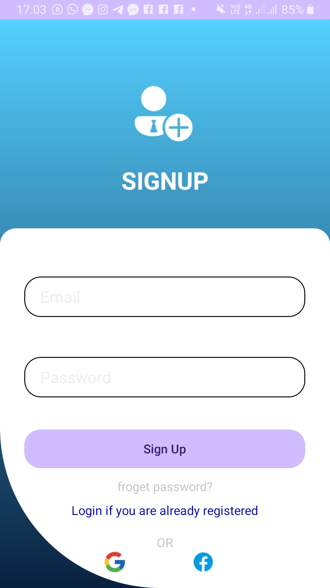
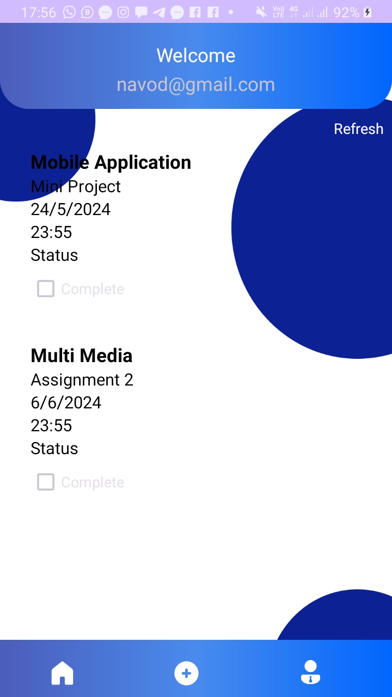
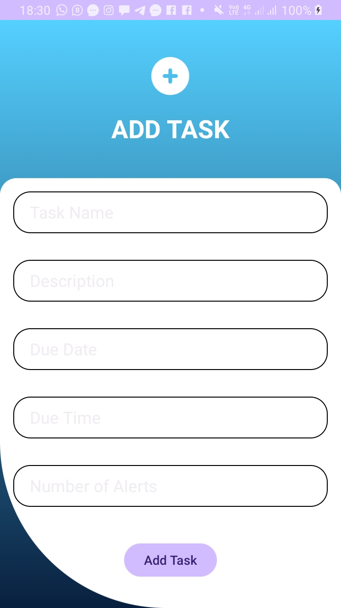

# To-Do List Application

## Table of Contents
- [Introduction](#introduction)
- [Features](#features)
- [Screenshots](#screenshots)
- [Prerequisites](#prerequisites)
- [Installation](#installation)
- [Usage](#usage)
- [Contributing](#contributing)
- [License](#license)

## Introduction
The To-Do List Application is a simple Android application that allows users to manage their tasks efficiently. Users can add, view, and manage tasks with details like name, description, due date, and time. The app uses SQLite for data storage.

## Features
- Add new tasks with name, description, due date, and time.
- View a list of all tasks on the dashboard.
- Delete tasks.
- User-friendly interface with Material Design components.

## Screenshots
### Dashboard


### Add Task


### Task List


## Prerequisites
- Android Studio
- An Android device or emulator running Android 5.0 (Lollipop) or higher

## Installation

### Clone the Repository
Clone this repository to your local machine using the following command:
```bash
git clone https://github.com/kavindurs8/ToDoList-App
